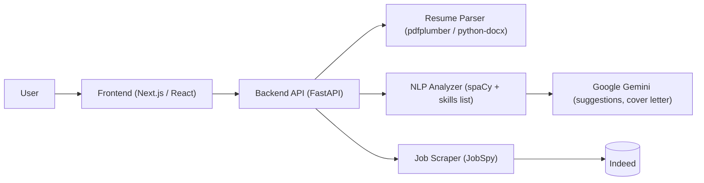

# Resume Improvement & Job Scraper Agent

An AI-powered full-stack application that analyzes an uploaded resume against a job
description, generates LLM-written improvement suggestions and cover letters, and
searches Indeed for job listings that match the resume.

This project is designed as a **Resume Improvement Agent**, helping users tailor their
resumes to specific job roles, improve job-fit quality, and find jobs that match their
resume profile.

---

## Problem Statement

Job seekers often struggle to customize their resumes for individual job descriptions.
Manual tailoring is time-consuming, inconsistent, and often leads to poor **ATS
(Applicant Tracking System)** compatibility, reducing interview opportunities.

---

## Solution Overview

The system automates resume tailoring by:

- Accepting a resume upload (PDF or DOCX) and extracting its raw text.
- Accepting a job description as pasted text.
- Parsing both with spaCy (named-entity recognition) and matching against a curated
  skills list.
- Scoring the resume against the job description and identifying matched vs. missing skills.
- Using Google Gemini to rewrite resume bullet points and draft a cover letter.
- Searching Indeed (via JobSpy) for listings matching either a user query or the skills
  found in the resume.

> **Note:** the app does *not* scrape a job description from a URL. Job descriptions are
> pasted in as text; the scraper is used separately to find job *listings*.

---

## Key Features

- **Resume Upload & Parsing**: Accepts `.pdf` (via pdfplumber) and `.docx` (via
  python-docx) uploads and extracts their text. Other file types are rejected with a
  415 response.
- **NLP Analysis**: Uses spaCy's `en_core_web_sm` model for named-entity recognition
  (person, organizations, etc.) plus keyword matching against a built-in list of ~45
  technical and professional skills.
- **Resume–Job Match Score**: Reports a percentage score computed as the share of skills
  found in the job description that also appear in the resume, alongside explicit
  matched-skills and missing-skills lists.
- **LLM-Based Resume Rewriting**: Sends the resume and its missing skills to Google
  Gemini (`gemini-2.5-flash`), which rewrites one or two existing bullet points to
  incorporate those skills without inventing new experience.
- **AI Cover Letter Generation**: Generates a three-paragraph cover letter from the
  resume, the job description, the matched skills, and entities extracted from the
  resume (candidate name, past organizations).
- **Job Search from Resume**: Searches Indeed through the JobSpy library. Uses an
  optional user-supplied query and location, falling back to the skills extracted from
  the resume when no query is given. Returns job title, company, location, and link.
- **Modern Web Frontend**: A single-page Next.js App Router UI with file upload, job
  description input, query/location fields, and result panels.

---

## System Architecture



---

## API Endpoints

All endpoints are served from `http://localhost:8000`. Interactive docs are available at
`/docs`.

| Method | Path | Input | Returns |
| --- | --- | --- | --- |
| `GET` | `/` | – | Health/welcome message |
| `POST` | `/analyze/` | `resume_file`, `job_description` | Match score, enhancement suggestions, matched & missing skills |
| `POST` | `/generate-cover-letter/` | `resume_file`, `job_description` | Generated cover letter text |
| `POST` | `/find-jobs/` | `resume_file`, optional `search_query`, optional `location` (default `remote`) | Job listings, search terms used, extracted skills |

Requests are `multipart/form-data`.

---

## Tech Stack

### Frontend

* **Next.js 15** (App Router)
* **React 19**
* **Tailwind CSS v4**
* **JavaScript**

### Backend

* **Python** (developed on 3.11)
* **FastAPI** + **Uvicorn**
* **spaCy** (`en_core_web_sm`) for NLP
* **Google Gemini** via **google-generativeai**
* **pdfplumber** (PDF parsing) and **python-docx** (DOCX parsing)
* **JobSpy** (`python-jobspy`) + **pandas** for job scraping

### Tools and Platforms

* **Git**
* **GitHub**
* **REST APIs**

---

## How to Run Locally

### 1. Clone the Repository

```bash
git clone https://github.com/aryannaresh04/resume-improvement-job-scrapper.git
cd resume-improvement-job-scrapper
```

### 2. Backend Setup

From the repository root:

```bash
# Create virtual environment
python -m venv venv

# Activate virtual environment
# For macOS / Linux:
source venv/bin/activate
# For Windows:
# venv\Scripts\activate

# Install dependencies
pip install -r requirements.txt

# Download the spaCy model used by the analyzer (required)
python -m spacy download en_core_web_sm
```

### 3. Environment Variables

Create a `.env` file in the repository root. The backend loads it with `python-dotenv`
at startup and will refuse to start the server without it.

```
GOOGLE_API_KEY=
```

* `GOOGLE_API_KEY` — a Google AI Studio API key with access to the Gemini API.

`.env` is git-ignored; never commit real keys.

### 4. Run the Backend

```bash
python main.py
```

The API starts on **http://localhost:8000** (bound to `0.0.0.0:8000`).

### 5. Frontend Setup

Open a new terminal and navigate to the frontend directory.

```bash
cd resume-agent-frontend

# Install dependencies
npm install

# Start the development server
npm run dev
```

Access the application at: **http://localhost:3000**

The frontend calls the backend at a hard-coded `http://localhost:8000`, and the backend's
CORS policy only allows `http://localhost:3000`. Both defaults must be used together, or
both changed.

---

## Example Workflow

1. **Upload**: User uploads a resume (PDF or DOCX).
2. **Paste**: User pastes a job description into the text area.
3. **Analyze**: The resume and job description are parsed with spaCy and matched against
   the skills list, producing a match score and a missing-skills list.
4. **Improve**: Gemini rewrites resume bullet points to cover the missing skills.
5. **Cover Letter** *(optional)*: Gemini drafts a tailored cover letter.
6. **Find Jobs** *(optional)*: JobSpy searches Indeed using either the user's query or the
   resume's skills, and the matching listings are displayed.

---

## Use Cases

* Resume optimization for specific job roles.
* Cover letter drafting for a specific posting.
* Job discovery based on skills already present in a resume.
* Academic demonstration of AI and full-stack development.
* Portfolio project for software engineering and AI roles.

---

## Known Limitations

* Skill detection relies on a hard-coded list in `main.py`; skills outside that list are
  invisible to the analyzer.
* Job scraping is limited to Indeed and is currently hard-coded to `country_indeed='India'`
  in `job_scraper.py`.
* The match score measures keyword overlap only — it is not an ATS compatibility score.

---

## Future Enhancements

* [ ] User authentication and profile management.
* [ ] ATS compatibility metrics (beyond the current keyword-overlap score).
* [ ] Resume export (e.g. downloading an improved resume as PDF/DOCX).
* [ ] Cloud deployment and scalability.
* [ ] Support for multiple job platforms (JobSpy also supports LinkedIn, ZipRecruiter,
  Glassdoor).

---

## Academic and Professional Relevance

This project demonstrates:

* Application of **AI and NLP techniques**.
* **Full-stack software engineering** practices.
* **Modular system design**.
* Practical automation for real-world career problems.

---

## Author

**Aryan Naresh**
*Computer Science | Artificial Intelligence | Cyber Security*

GitHub: [aryannaresh04](https://github.com/aryannaresh04)


---

## Acknowledgements

This project was developed as part of an academic exploration into AI-driven automation
and software engineering best practices.
